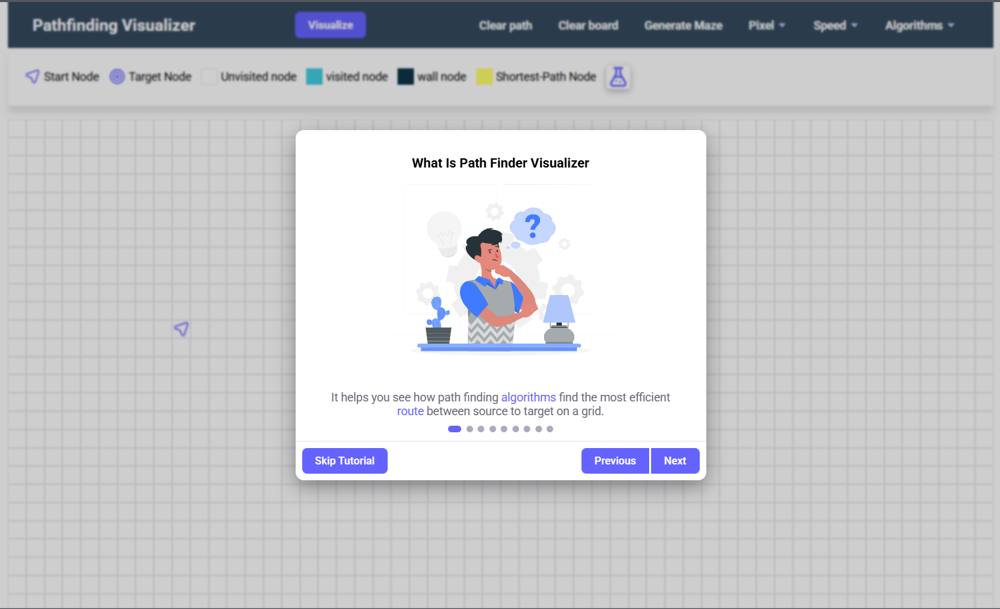
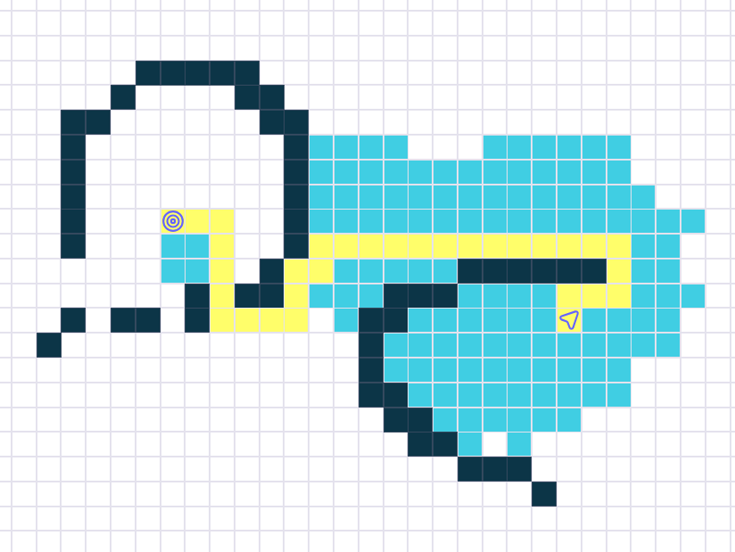
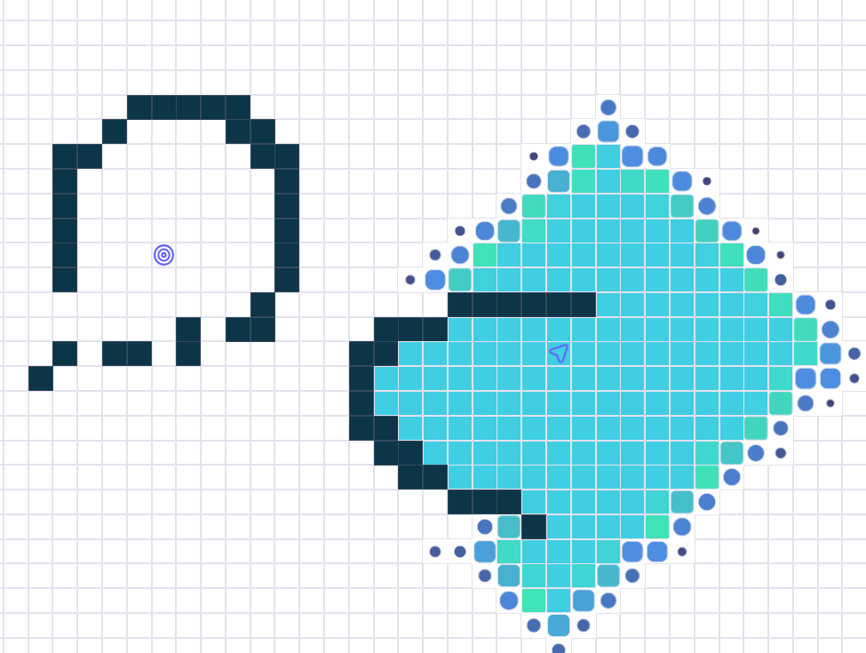
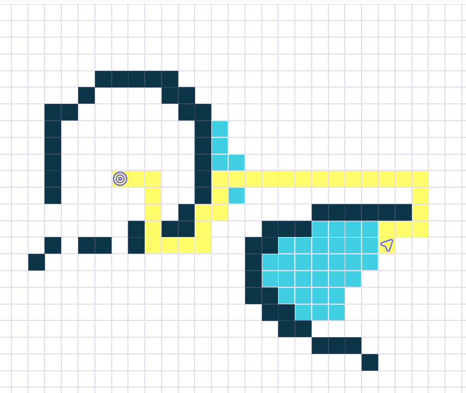
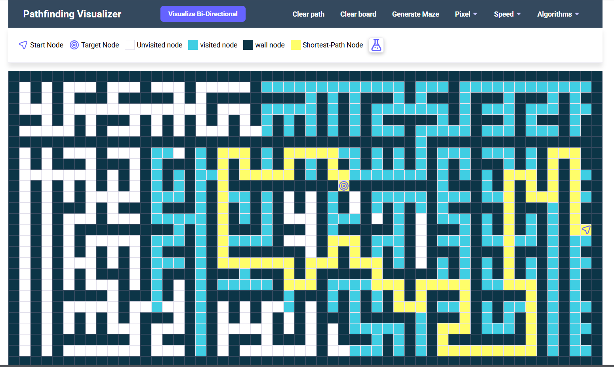

# 🚀 PathFinderVisualizer - Interactive Pathfinding Algorithm Visualizer  

[](https://app.netlify.com/sites/path-explorer/deploys)
[](https://opensource.org/licenses/MIT)
[](https://github.com/abhijeetSinghRajput/pathFinderVisualizer/pulls)

**Visualize how pathfinding algorithms work in real-time!**  
A clean, interactive web app built with pure JavaScript to demonstrate Dijkstra's, A*, BFS, DFS and more.

[▶ **Live Demo**](https://path-explorer.netlify.app) | [🎥 **Video Tutorials**](https://www.youtube.com/watch?v=Oaf9mR9oDT8&list=PLZ92O1inS6VmlSaCzdxm5_Jf2IyJesCF4)

  
*Watch algorithms find their way through custom mazes!*

---

## ✨ Key Features

- **Interactive Grid Editor**
  - Paint walls with click-and-drag
  - Movable start/end points
  - Random maze generation
  - Dynamic weight adjustment (for weighted algorithms)

- **Multiple Algorithms**
  - Dijkstra's Algorithm (weighted)
  - A* Search (with heuristic visualization)
  - Breadth-First Search (BFS)
  - Depth-First Search (DFS)
  - Bi-directional BFS (new!)
  - Greedy Best-First Search

- **Learning Tools**
  - Step-by-step algorithm animation
  - Speed control (slow-mo to fast-forward)
  - Node inspection during visualization
  - Path cost display
  - Tutorial mode (new!)

---

## 🖥️ Screenshots Gallery

|  |  |
|----------------------------------------------------|-------------------------------------------------|
| *Interactive Tutorial Mode*                        | *A* Algorithm Visualization*                   |

|  |  |
|-----------------------------------------------------------|------------------------------------------------------|
| *Dijkstra's Algorithm in Action*                          | *Greedy Best-First Search*                          |

|  |
|---------------------------------------------------|
| *Random Maze Generation Feature*                  |

---

## 🚀 Quick Start

### Option 1: Live Demo
Visit [path-explorer.netlify.app](https://path-explorer.netlify.app) and start visualizing immediately!

### Option 2: Local Installation
```bash
git clone https://github.com/abhijeetSinghRajput/pathFinderVisualizer.git
cd pathFinderVisualizer
# Open index.html in your browser